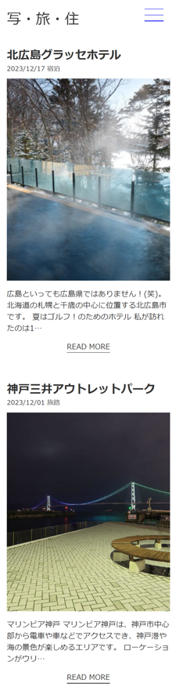

<div id="top"></div>

## 使用技術一覧

<!-- シールド一覧 -->
<!-- 該当するプロジェクトの中から任意のものを選ぶ-->
<p style="display: inline">
  <!-- フロントエンドのフレームワーク一覧 -->
  
  
  <!-- バックエンドの言語一覧 -->
  
  <!-- ミドルウェア一覧 -->

</p>

## 目次

1. [プロジェクトについて](#プロジェクトについて)
2. [画面レイアウト](#画面レイアウト)
3. [ディレクトリ構成](#ディレクトリ構成)
4. [開発環境構築](#開発環境構築)
5. [トラブルシューティング](#トラブルシューティング)

<!-- プロジェクト名を記載 -->

## プロジェクト名

WordPress オリジナルテーマによるプロ写真家のポートフォリオサイト

<!-- プロジェクトについて -->

## プロジェクトについて

在日米国人写真家のポートフォリオサイト。WordPress で作成。オリジナルテーマです。デザインは２カラムレイアウトのサイトをいくつか大いに参考にさせて頂きましたが、HTML／CSS は 0→1 でコーディングしました。もちろんレスポンシブ対応です。

<!-- プロジェクトの概要を記載 -->

<p align="right">(<a href="#top">トップへ</a>)</p>

## 画面レイアウト


<br /><br />


## プロジェクト URL

http://yah2026.work/

## 環境

<!-- 言語、フレームワーク、ミドルウェア、インフラの一覧とバージョンを記載 -->

| 言語・フレームワーク | バージョン |
| -------------------- | ---------- |
| HTML                 | 5          |
| CSS                  | 3          |
| PHP                  | 8.1.22     |
| WordPress            | 6.4.2      |

その他のパッケージのバージョンは pyproject.toml と package.json を参照してください

<p align="right">(<a href="#top">トップへ</a>)</p>

## ディレクトリ構成

<!-- Treeコマンドを使ってディレクトリ構成を記載 -->
<pre>
.
│  404.php
│  category.php
│  date.php
│  footer.php
│  functions.php
│  hamburger.js
│  header.php
│  index.php
│  loop.php
│  page.php
│  README.md
│  search.php
│  searchform.php
│  sidebar.php
│  single.php
│  style.css
│
└─img
    │  profile.jpg
    │
    ├─common
    │      favicon.ico
    │      favicon_bak.ico
    │      logo.svg
    │      search.png
    │
    └─sidebar
            author.jpg
</pre>
<p align="right">(<a href="#top">トップへ</a>)</p>

## 開発環境構築

<!-- コンテナの作成方法、パッケージのインストール方法など、開発環境構築に必要な情報を記載 -->

### 新規 WordPress を立ち上げ

Local アプリケーションなどを使い、新規で WordPress を立ち上げる.

### プラグイン All in One Migration をインストール

新規で立ち上げた WordPress にプラグイン All In One Migration をインストールして有効化する.

### 本番環境のファイルをインポート

本番環境の All In One Migration からエキスポートしたファイルを、新規で立ち上げた WordPress にインポートする.（エキスポートファイルの入手については本番サイトの[お問い合わせページ](http://yah2026.work/contact/)よりご連絡ください）

## トラブルシューティング

### Warning: Undefined array key 0 in /home/cf437555/cf437555.cloudfree.jp/public_html/wp-content/themes/blog/page.php on line 9

固定ページで上記のようなエラーが画面に表示される場合がある.
<br />
解決方法：page.php ファイルにて以下のコードを修正.

```php
// 修正前
$catname = $cat[0]->cat_name
```

```php
// 修正後
$catname = !empty($cat) ? $cat[0]->cat_name : ''; // カテゴリーが存在する場合のみアクセス
```

<p align="right">(<a href="#top">トップへ</a>)</p>
